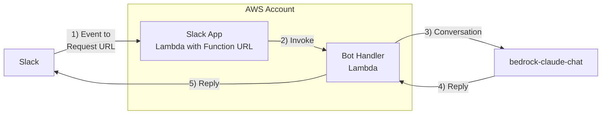

# slack-chatbot-fn

slack-chatbot-fn is a Slack app that acts as Slack Workflow Custom Function to interact with [bedrock-claude-chat](https://github.com/aws-samples/bedrock-claude-chat) published API. slack-chatbot-fn consists of several AWS Lambda function and CDK stack to deploy them.

## Architecture

## Usage
1. copy `.env.example` to `.env`
2. `source .env && npx cdk deploy` to deploy the stack.
   Note the `LambdaFunctionURL` and `ElasticIP` from the output.
   NOTE: at this point app is not properly configured yet.
3. On bedrock-claude-chat, allow API access from `ElasticIP` noted above.
4. On bedrock-claude-chat, create a default chatbot and fill `DEFAULT_API_ENDPOINT` and `DEFAULT_API_KEY` in `.env`
5. On Slack, create and install a new app with `manifest.json` and fill `SLACK_BOT_TOKEN`, `SLACK_SIGNING_SECRET`.
   NOTE: `settings.event_subscription.request_url` should be `LambdaFunctionURL`
6. `source .env && npx cdk deploy` to update the stack.
7. On Slack, add the app to a channel and create new workflow.
   The workflow should be triggerd with an emoji reaction and execute a custom step `Custom/slack-chatbot-fn/Invoke ChatBot`.
   Set custom step's `Slack Message URL` to `{} Link to the message that was reacted to`
